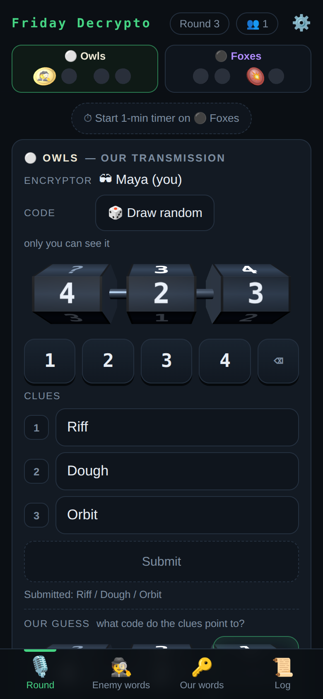
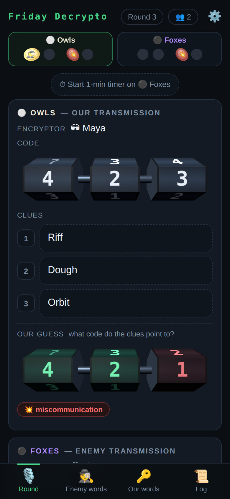
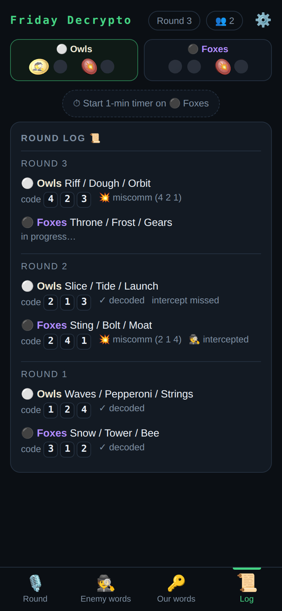
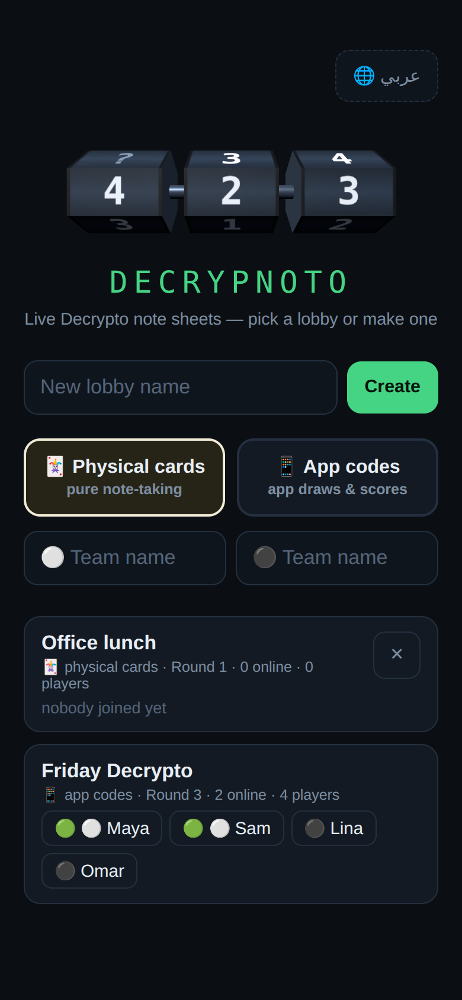
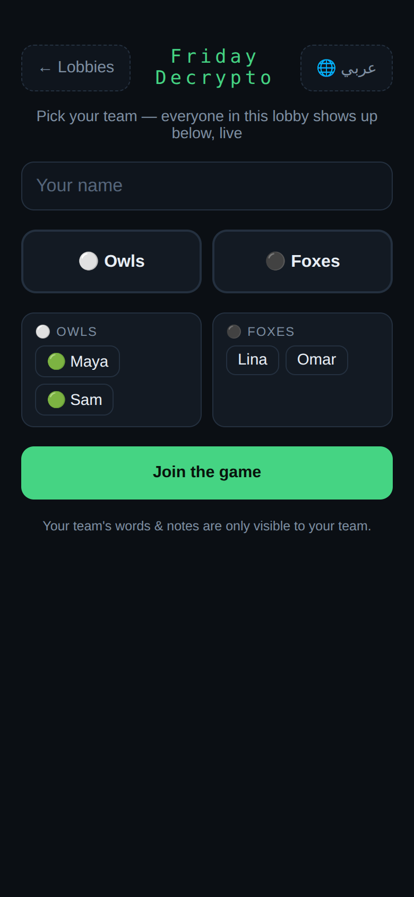
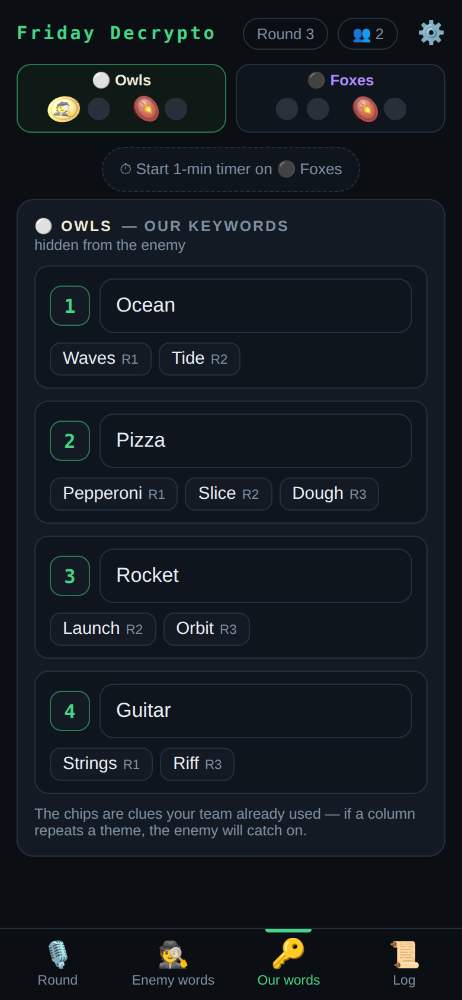
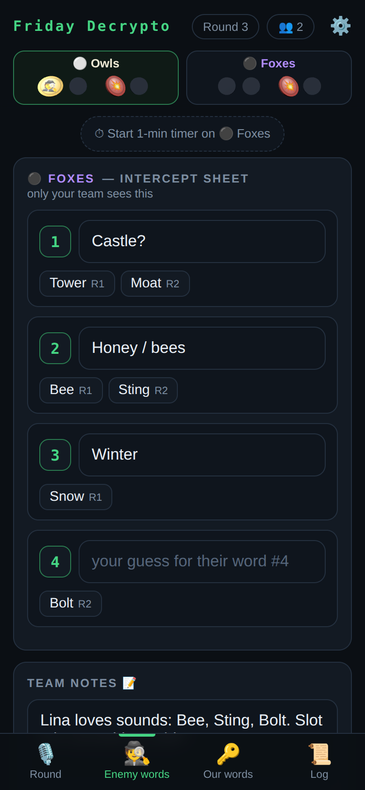
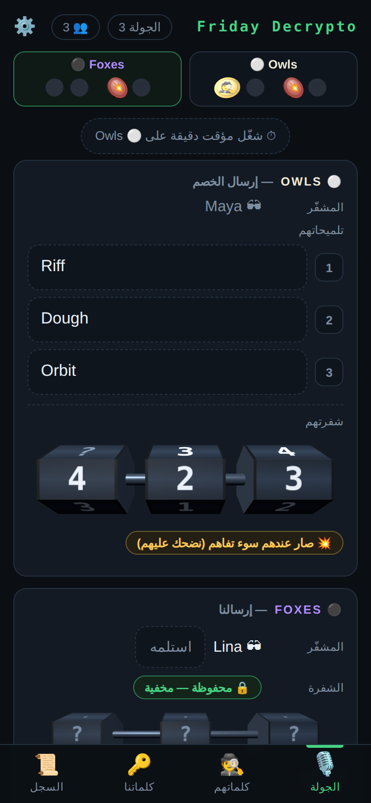

# Decrypnoto 🔐

**A live, shared note sheet for the board game Decrypto.**
One person runs the server. Everyone else opens it in their phone browser and takes notes together in real time. No installs, no accounts, no dependencies, just Node.

<p align="center">
  
  
  
</p>

Taking Decrypto notes on your phone is miserable, and half the game is remembering which clues the enemy gave for which keyword. Decrypnoto does that bookkeeping for you.

---

## 🚀 Quick start

```
node server.js
```

That's it. No `npm install` is needed. The server prints two addresses:

```
On this PC:   http://localhost:4321
Friends join: http://192.168.x.x:4321
```

Friends on the same Wi-Fi open the second one.

> 💡 On Windows, allow Node through the firewall the first time (Private networks is enough).

---

## 📸 Screenshots

| Pick a lobby | Join a team | Your keywords |
| :---: | :---: | :---: |
|  |  |  |
| Create a room or tap one to join. Green dot = online now. | Pick a name and a team. The roster updates live. | Your secret words, plus every clue you've already used for each one. |

| Give clues | Reveal | Crack their words |
| :---: | :---: | :---: |
|  |  |  |
| Only the encryptor sees the code. Tap it in on the keypad (or 🎲 draw one), then **Submit** the clues. | The lock spins open to the real code and your guess lights up digit by digit. Tokens drop into the scoreboard. | Enemy clues get filed under slots 1–4 automatically. Add your guesses and team notes. |

<p align="center">
  <br>
  <sub>One tap switches the whole UI to Arabic with a right-to-left layout.</sub>
</p>

---

## ✨ Features

### Two ways to play

| Mode | Best for | How it works |
| --- | --- | --- |
| 🃏 **Physical cards** | Playing with the real box | Pure note-taking with no turns or roles. Anyone types clues as they're said out loud. When a code card is revealed, punch in the 3 digits and every clue is **filed under the right keyword**. Token counters mirror the physical tokens. |
| 📱 **App codes** | Playing without the code cards | The app draws secret codes, collects guesses from both teams and **scores tokens automatically**, including the win/lose banners. |

### 📱 Made for the phone in your hand

- 🔐 **Codes are 3D cipher locks.** Every code (your secret code, your team's guess, the interception) is a row of three rolling drums, drawn with three.js. Drawing a code or revealing one spins them like a slot machine, and on reveal each guessed digit turns green or red.
- 🔢 **A keypad, not a grid.** Tap the digits in order like a PIN. Tap a drum first to change just that digit, ⌫ to undo. Digits can't repeat, so taken ones dim.
- 🪙 **Tokens are coins.** The scoreboard has two slots for 🕵️ and two for 💥, since two of either ends the game. New tokens drop in with a bounce.
- 👆 **Thumb-friendly.** Big tap targets, a bottom tab bar, and a sideways swipe to change tabs. The tab bar steps aside while the keyboard is open, and **Enter** jumps to the next clue.
- 🏠 **Add to Home Screen** for a full-screen app with its own icon.
- 🔋 **Easy on the battery.** The 3D layer only draws while something is moving, and phones without WebGL (or with reduced motion turned on) get plain digit tiles that work the same.

### Notes that do the work

- 🕵️ **Intercept sheet.** Every enemy clue is grouped by keyword slot and tagged with its round. Each slot has a guess field, and there's a shared team notepad.
- 🔑 **Your own clue history.** See which clues your team already used for each keyword, so you notice when you're getting predictable.
- 🔒 **Private notepad.** Each player gets a scratchpad that nobody else can see.
- ✍️ **Draft, then submit.** Nobody watches your half-typed clues. If a teammate submits while you're drafting, fields you haven't touched update to theirs, so nothing gets overwritten.

### Fair play built in

- 🙈 **Team secrets stay secret.** Keywords, notes, codes and guesses are filtered **on the server** for each player. The other team can't peek, even in the browser's network tab.
- 🔁 **Team switches need approval.** Every online member of the team you're joining must accept, since you're about to see their words. Leaving and rejoining on the other side is blocked too.
- 👑 **Lobby owner controls.** The creator can start a new game, rename teams, kick players (and let them back in) and delete the lobby. If the owner leaves, the crown passes on.

### Everything else

- ⚡ **Live updates.** Every change reaches every phone instantly.
- 💾 **Nothing gets lost.** State is saved to disk, so a server restart doesn't lose any games.
- 🏠 **Many lobbies at once.** Several groups can play side by side. Lobbies unused for **3 days** delete themselves (change this with `LOBBY_TTL_MS`).
- ⏱️ **1-minute pressure timer.** Start one on the other team when they're taking too long.
- 🌐 **English / Arabic.** Each device picks its own language, with full right-to-left support.

---

## 🎲 How a round works (app-codes mode)

1. **Claim the role.** One teammate taps **"I'm giving the clues"**. Only they see the code (🎲 draws a random one, or tap one in).
2. **Give clues.** They type 3 clues and hit **Submit**. Everyone sees them instantly.
3. **Guess.** Your team taps its decode guess into the keypad. From round 2, the enemy enters an intercept guess.
4. **Reveal.** The lock spins open and tokens are scored automatically: **2 🕵️ interceptions wins**, **2 💥 miscommunications loses**. The clues are filed into the keyword columns.

In physical-cards mode these steps happen at the table. The app just captures the clues and revealed codes, then does the filing and token math.

---

## 🌍 Hosting options

<details>
<summary><b>🐳 Docker</b></summary>

```
docker compose up -d --build
```

Runs with `restart: unless-stopped`. Game state lives in the `decrypnoto-data` volume (the `STATE_FILE` env var sets the path).

</details>

<details>
<summary><b>☁️ Playing with remote friends</b></summary>

Any tunnel works. With Cloudflare:

```
cloudflared tunnel --url http://localhost:4321
```

This gives you a throwaway public URL. For a permanent one, add a public hostname on a named Cloudflare Tunnel pointing at `http://localhost:4321` (path empty).

</details>

> ⚠️ There are no accounts, so **anyone with the URL can open your lobbies**. Share the link privately.

---

## 🧪 Tests

```
npm test          # or: node test/e2e.js
```

A zero-dependency end-to-end suite with about 230 checks that runs in under 20 seconds. It starts a real server with a throwaway state file and plays as several players at once. It covers lobbies, ownership, team secrecy, both game modes, switch approvals, kicks and bans, timers, restarts, corrupt-save recovery and hostile input. It also tests the browser client's draft-merge, scoring and keypad logic.

---

## 🛠 Tech

| Part | What it is |
| --- | --- |
| **Server** | One file with zero dependencies: Node HTTP + Server-Sent Events, and a filtered view for each client |
| **Client** | A vanilla JS single page. Mobile-first, dark theme, English/Arabic with RTL |
| **3D layer** | `public/viz.js`: the cipher locks and coins, built from `client/viz.js` with three.js bundled in (about 140 KB gzipped). The app works without it |
| **State** | `game-state.json` (or the Docker volume). Delete it to reset everything |

The server gzips text files and sends ETags, so phones only re-download what changed.

### Changing the 3D layer

`public/viz.js` is committed, so running the app never needs npm. Only to edit the locks or coins:

```
npm install        # three.js + esbuild, dev-only
npm run build      # client/viz.js → public/viz.js
```

The screenshots in `docs/screenshots/` come from a demo game running on the real app.
